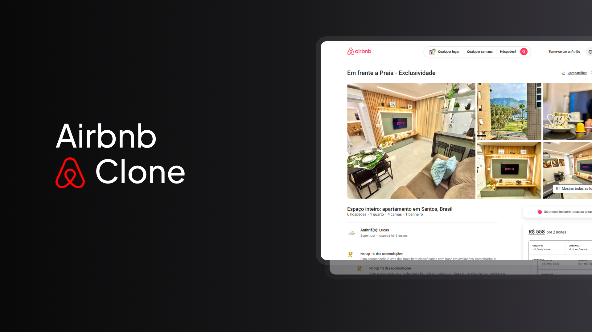

<h1 align="center">Airbnb Clone</h1>

  <a href="#-tecnologias">Tecnologias</a>&nbsp;&nbsp;&nbsp;|&nbsp;&nbsp;&nbsp;
  <a href="#-projeto">Projeto</a>&nbsp;&nbsp;&nbsp;|&nbsp;&nbsp;&nbsp;
  <a href="#-deployment">Deployment</a>&nbsp;&nbsp;&nbsp;|&nbsp;&nbsp;&nbsp;
  <a href="#-autores">Autores</a>

 

  

## 🚀 Tecnologias

Este projeto foi desenvolvido com as seguintes tecnologias:

## 💻 Projeto

Este projeto é um clone de uma página de imóvel do Airbnb, desenvolvido como **entrega acadêmica para a disciplina de front-end do curso de engenharia de software da FIAP**.  

O objetivo do projeto é reproduzir a interface de um anúncio de imóvel, incluindo imagens, informações do imóvel e elementos estáticos, proporcionando uma experiência visual semelhante à do site original.

## 🔗 Referência

A página original que serviu como inspiração pode ser acessada aqui:  
[Em frente a Praia - Exclusividade (Airbnb)](https://www.airbnb.com.br/rooms/1472023804963610626?check_in=2025-11-07&check_out=2025-11-09&photo_id=2266828535&source_impression_id=p3_1756446494_P3pFTXbTZlGzC3NB&previous_page_section_name=1000)

 ## 🌍 Deployment

Você pode acessar o projeto diretamente através de:
- <a href="https://airbnb-clone-cp4.vercel.app" target="_blank">Airbnb Clone em Vercel (recomendado)</a> 👈
- [Airbnb Clone em GitHub Pages](https://augusto-valerio.github.io/Airbnb-Clone/) 👈

---

## 👨‍💻 Autores
- [Augusto Valerio](https://github.com/Augusto-Valerio)
- [Jonas Esteves](https://github.com/JonasEstevess)

